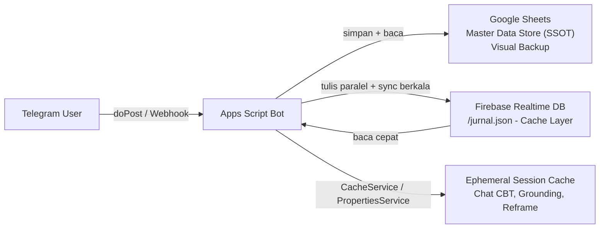

# 🌿 Xenovia Care — CBT Companion Bot

> **Teman pendamping terapi CBT berbasis AI** — Bot Telegram interaktif untuk jurnal emosi, reframing kognitif, pelacakan kesehatan mental harian, dan grounding sensorik. Google Sheets berperan sebagai **Master Data Store (SSOT) & Visual Backup**, dipercepat oleh **Firebase Realtime Database** sebagai caching/speed layer untuk operasi baca.

[](https://script.google.com/)
[](https://core.telegram.org/bots/api)
[](https://platform.deepseek.com/)
[](https://sheets.google.com/)
[](https://firebase.google.com/)
[](https://groq.com/)

---

## 🚀 Fitur Unggulan

| Fitur | Deskripsi |
|:------|:----------|
| 🧠 **Jurnal & Reframing CBT Interaktif** | Bimbingan refleksi terstruktur: Peristiwa → Pikiran Otomatis → Distorsi Kognitif → Bukti Tandingan → Pikiran Seimbang |
| 🎤 **Voice Message Support** | Transkripsi otomatis pesan suara via Groq Whisper untuk input tanpa mengetik |
| 🏆 **Narasi Kemenangan** | Pengingat naratif keberhasilan berbasis data jurnal masa lalu |
| 📊 **Statistik Emosi** | Analisis distribusi pola emosi mingguan/bulanan dengan insight AI |
| 📋 **Rekap Perkembangan** | Rangkuman tren perkembangan CBT dalam periode tertentu |
| 🚑 **Reframing Instan** | P3K reframing untuk momen darurat kepanikan atau overthinking |
| 🌿 **Grounding 5-4-3-2-1** | Latihan sensorik interaktif untuk mengatasi kepanikan secara real-time |
| 🔍 **Pencarian Riwayat** | Cari catatan & reframing masa lalu langsung dari Google Sheets |
| ⚓ **Anchor Harian** | Pesan pegangan utama harian via cron job (auto-write ke Sheet + kompatibel Widget KWGT Android) |

---

## 🛠️ Tech Stack & Prasyarat Sistem

### Tech Stack

| Komponen | Teknologi |
|:---------|:----------|
| **Runtime** | Google Apps Script (V8 Engine, CommonJS) |
| **AI Engine (Utama)** | DeepSeek V4 Flash via OpenRouter API |
| **AI Engine (Stats/Grounding)** | Google Gemini 3.5 Flash Lite |
| **Speech-to-Text** | Groq Whisper (Audio Transcription) |
| **Platform Interface** | Telegram Bot API (Webhook via Apps Script) |
| **Database & Storage (Master)** | Google Sheets API v4 — SSOT & Visual Backup |
| **Database (Caching/Speed Layer)** | Firebase Realtime Database (REST API + Database Secret) |
| **Session Cache (Ephemeral)** | `CacheService` & `PropertiesService` (Chat CBT, Grounding, Reframe) |
| **Deployment** | CLASP (Command Line Apps Script) |
| **Timezone** | Asia/Jakarta (WIB) |

### Prasyarat

- **Google Account** — untuk Apps Script, Google Sheets, dan Service Account
- **Telegram Bot Token** — dapatkan dari [@BotFather](https://t.me/BotFather)
- **OpenRouter API Key** — daftar di [openrouter.ai](https://openrouter.ai/)
- **Google Gemini API Key** — daftar di [aistudio.google.com](https://aistudio.google.com/)
- **Groq API Key** — daftar di [groq.com](https://groq.com/)
- **Firebase Project** — Realtime Database (mode test/locked) dengan **Legacy Database Secret** diaktifkan
- **CLASP CLI** — `npm install -g @google/clasp`

---

## 🏗️ Arsitektur System / Flow Data

Xenovia Care memakai pola **dual-layer storage**: Google Sheets sebagai sumber kebenaran, Firebase Realtime Database sebagai lapisan akselerasi.



| Layer | Peran | Contoh Penggunaan |
|:------|:------|:------------------|
| **Google Sheets** | Master Data Store (SSOT) & Visual Backup — data mentah per tab bulanan (contoh: `Juli 2026`, `Agustus 2026`) | Semua data jurnal permanen, arsip, edit manual |
| **Firebase Realtime DB** | Caching/Speed Layer via REST API — satu koleksi datar di node `/jurnal.json` | Operasi baca kencang: `/win`, `/cari`, `/stats`, `/rekap` (Firebase-first, fallback ke Sheet) |
| **CacheService / PropertiesService** | Ephemeral session cache — tidak menyentuh Firebase | Chat CBT interaktif (DeepSeek), Grounding 5-4-3-2-1, state Reframe |

**Alur Data:**

1. **Tulis** — setiap catatan CBT baru disimpan ke **Google Sheets** (SSOT) dan **paralel** ke Firebase via `saveToFirebase()` (POST).
2. **Baca** — operasi `/win`, `/cari`, `/stats`, `/rekap` membaca dari Firebase terlebih dahulu (`getLatestRowsFromFirebase` / `searchFirebase`); bila Firebase belum dikonfigurasi/kosong, otomatis fallback membaca Google Sheets.
3. **Sync berkala** — `keepWarm()` (time-driven trigger) menjalankan **Smart Sync** untuk menyatukan seluruh tab jurnal bulanan ke Firebase.

> Sesi chat interaktif (DeepSeek CBT, Grounding 5-4-3-2-1, Reframe) sengaja **tidak** memakai Firebase — cukup `CacheService`/`PropertiesService` yang ephemeral demi efisiensi dan kecepatan respons.

---

## ⚙️ Panduan Instalasi & Setup Lokal

### 1. Clone Repository & Install Dependencies

```bash
# Clone repository
git clone https://github.com/akhmadnurh/xenovia-care-cbt.git
cd xenovia-care-cbt

# Install CLASP & dependencies
npm install
```

### 2. Setup CLASP & Google Apps Script

```bash
# Login ke Google Account
clasp login

# Buat file .clasp.json secara manual di root project:
```

```json
{
  "scriptId": "YOUR_APPS_SCRIPT_ID",
  "rootDir": "./",
  "filePushOrder": [
    "config.js",
    "services.js",
    "firebaseService.js",
    "sheetLogger.js",
    "cbtHandler.js",
    "groundingHandler.js",
    "cron.js",
    "main.js"
  ],
  "ignore": [
    ".git",
    ".clasp.json",
    "node_modules",
    "README.md",
    "package*.json"
  ]
}
```

### 3. Setup Google Service Account & Spreadsheet

1. Buka [Google Cloud Console](https://console.cloud.google.com/)
2. Buat project baru → Enable **Google Sheets API** & **Google Apps Script API**
3. Buat **Service Account** → Download file `credentials.json`
4. Buat **Google Spreadsheet** baru (ini akan menjadi database bot)
5. Copy `Spreadsheet ID` dari URL:
   ```
   https://docs.google.com/spreadsheets/d/{SPREADSHEET_ID}/edit
   ```
6. **Share Spreadsheet** ke email Service Account dengan permission **Editor**

### 4. Setup Firebase Realtime Database (Caching Layer)

1. Buka [Firebase Console](https://console.firebase.google.com/) → buat project baru (atau pakai project existing)
2. **Build** → **Realtime Database** → **Create Database** → pilih region (misal `asia-southeast1`)
3. Atur mode **test mode** (atau locked) lalu aktifkan **Legacy Database Secrets**:
   - *Project Settings* → tab *Service accounts* → bagian *Database Secrets*
   - Klik **Show** untuk menampilkan secret → salin nilainya
4. Salin **Database URL** dari halaman Realtime Database (contoh: `https://<project-id>-default-rtdb.asia-southeast1.firebasedatabase.app`)

### 5. Konfigurasi Script Properties

Buka **Google Apps Script Editor** (`clasp open`) → tab **Project Settings** → **Script Properties** → Tambahkan:

| Property Name | Keterangan |
|:--------------|:-----------|
| `TELEGRAM_TOKEN` | Token dari BotFather |
| `OPENROUTER_API_KEY` | API Key OpenRouter (untuk DeepSeek) |
| `GEMINI_API_KEY` | API Key Google Gemini |
| `GROQ_API_KEY` | API Key Groq (untuk Whisper) |
| `SPREADSHEET_ID` | ID Google Spreadsheet |
| `FIREBASE_URL` | URL Firebase Realtime Database (contoh: `https://<project-id>-default-rtdb.asia-southeast1.firebasedatabase.app`) |
| `FIREBASE_SECRET` | Legacy Database Secret dari Firebase Console (Project Settings → Service Accounts → Database Secrets) |
| `GIF_BREATHING_URL` | *(Opsional)* URL Direct Raw animasi Box Breathing (contoh: `https://raw.githubusercontent.com/.../box-breathing.gif`) atau Telegram `file_id`. Bila kosong, bot memakai GIF fallback bawaan |
| `USER_CHAT_ID` | *(Opsional)* Chat ID Telegram kamu (auto-set saat pertama kali interaksi) |

> ⚠️ **Catatan:** `FIREBASE_URL` & `FIREBASE_SECRET` bersifat wajib untuk mengaktifkan caching layer. Tanpa keduanya, bot tetap berfungsi penuh (membaca langsung dari Google Sheets) — `firebaseAvailable()` akan bernilai `false`.

### 6. Deploy Bot

```bash
# Push kode ke Google Apps Script
clasp push

# Deploy sebagai Web App
clasp deploy -i YOUR_DEPLOYMENT_ID

# Atau buat deployment baru
clasp deploy --description "Xenovia Care v1.0" --type WEB_APP
```

Setelah deploy, set webhook Telegram:

```
https://api.telegram.org/bot<TOKEN>/setWebhook?url=<YOUR_APPS_SCRIPT_WEB_APP_URL>
```

### 7. Jalankan (Development)

```bash
# Push perubahan terbaru
clasp push

# Buka Apps Script Editor
clasp open
```

### 8. Setup Daily Trigger — Anchor Otomatis (05:00 WIB)

Untuk menjalankan pesan harian `/anchor` secara otomatis setiap pagi, buat **time-driven trigger** langsung dari UI Google Apps Script:

1. Buka Google Spreadsheet **"Xenovia Care - CBT"** kamu
2. Masuk ke menu `Extensions` → `Apps Script`
3. Pada sidebar sebelah **kiri**, klik ikon 🔔 **Triggers** (ikon jam)
4. Klik tombol **"+ Add Trigger"** di pojok kanan bawah
5. Konfigurasikan trigger sebagai berikut:

| Field | Nilai |
|:------|:------|
| **Choose which function to run** | `sendDailyAnchor` |
| **Choose which deployment should run** | `Head` |
| **Select event source** | `Time-driven` |
| **Select type of time based trigger** | `Day timer` |
| **Select time of day** | `5am to 6am` |

6. Klik **Save** → berikan **izin otorisasi Google** jika diminta

> ⚠️ **Catatan Penting:**
> - Fungsi `sendDailyAnchor()` akan mengambil `USER_CHAT_ID` dari Script Properties dan mengirim pesan anchor harian ke chat tersebut.
> - Pastikan kamu pernah berinteraksi dengan bot minimal sekali agar `USER_CHAT_ID` otomatis tersimpan.
> - Pesan anchor juga ditulis ke **Cell A1** tab **"Anchor"** di Google Sheets (berguna untuk integrasi KWGT).

### 9. Setup Keep-Warm & Smart Sync Firebase

Firebase diisi dan dijaga sinkronnya oleh `keepWarm()` — fungsi yang dipasang pada **time-driven trigger** interval 5–10 menit:

1. Buka **Apps Script Editor** → ikon 🔔 **Triggers** → **+ Add Trigger**
2. Konfigurasikan:

| Field | Nilai |
|:------|:------|
| **Choose which function to run** | `keepWarm` |
| **Choose which deployment should run** | `Head` |
| **Select event source** | `Time-driven` |
| **Select type of time based trigger** | `Minutes timer` |
| **Select minute interval** | `Every 5 minutes` |

3. Klik **Save** → berikan **izin otorisasi Google** jika diminta

**Logika Smart Sync** (`checkAndSyncFirebase()`) — sync ke Firebase hanya terjadi jika salah satu kondisi terpenuhi:

1. **Pertama kali jalan** — `LAST_FIREBASE_SYNC` belum pernah diset.
2. **Selisih waktu > 12 jam** sejak sync terakhir.
3. **Jumlah total baris berubah** — `getLastRow()` diakumulasi dari **seluruh tab jurnal bulanan** dan dibandingkan dengan `LAST_ROW_COUNT`; penambahan/pengurangan baris di tab manapun memicu sync ulang.

**Proses Sync** (`syncAllSheetToFirebase()`):

- Membaca **semua sheet** dari spreadsheet, lalu **memfilter** hanya tab jurnal bulanan — nama tab mengandung bulan Indonesia (misal `Juli 2026`) dan **bukan** tab `Widget_`/non-jurnal (misal `Widget_Anchor`).
- Hanya tab dalam **rentang 2 tahun terakhir** (tahun pada nama tab ≥ tahun berjalan − 2) yang diikutsertakan — data lama tetap aman di Sheet sebagai arsip, dan Firebase tidak membesar tanpa batas.
- Seluruh baris dari semua tab bulanan digabung menjadi **satu objek JSON datar** dengan key unik berbasis timestamp (`entry_<timestamp>`), lalu di-`PUT` ke node `/jurnal.json`.

### 10. Migrasi Awal (Inisialisasi Data Historis)

Jalankan **sekali** secara manual dari Apps Script Editor untuk mengisi Firebase dengan seluruh data jurnal historis:

1. Buka **Apps Script Editor** → pilih fungsi `syncAllSheetToFirebase` pada dropdown
2. Klik **Run** → berikan izin otorisasi jika diminta
3. Cek hasilnya di Firebase Console → Realtime Database → node `/jurnal`

> Alternatif: biarkan `keepWarm()` menjalankan sync otomatis — pada pemanggilan pertama `LAST_FIREBASE_SYNC` masih kosong sehingga sync langsung dieksekusi.

---

## 📱 Integrasi Widget KWGT (Android) - Opsional

Xenovia Care menyimpan **Pesan Anchor Harian** ke Google Sheets (tab `Anchor`, Cell A1). Kamu bisa menampilkan pesan ini secara otomatis di Home Screen HP Android menggunakan aplikasi **KWGT (Kustom Widget GT)**.

### 🛠️ Langkah-langkah Setup:

**1. Publish Sheet ke Web (Format CSV):**

- Buka Google Sheets → Klik **File** → **Bagikan (Share)** → **Publikasikan ke web (Publish to web)**
- Pilih lembar kerja **Anchor** dan ubah formatnya menjadi **Comma-separated values (.csv)**
- Klik **Publikasikan** dan salin URL terpublikasi tersebut (ambil nilai `gid` dari tab Anchor)

**2. Pasang Rumus di KWGT:**

- Tambahkan elemen **Text Item** baru pada Widget KWGT kamu
- Masukkan rumus/formula Kustom berikut ke dalam kolom **Text Formula**:

```kustom
$tc(reg, tc(reg, wg("https://docs.google.com/spreadsheets/d/e/{PUBLISHED_SHEET_ID}/pub?gid={GID_TAB_ANCHOR}&single=true&output=csv&nocache=" + mu(floor, df(m)/5) + gv(rf), txt), ",Last Update.*", ""), "^\x22\vert{}\x22,?", "")$
```

> ⚠️ **Yang perlu diganti pada rumus di atas:**
>
> | Placeholder | Ganti dengan |
> |:------------|:-------------|
> | `{PUBLISHED_SHEET_ID}` | ID sheet dari URL publikasi (bagian setelah `/d/e/`) |
> | `{GID_TAB_ANCHOR}` | Nilai `gid` tab Anchor dari URL publikasi |
>
> **Contoh URL publikasi:**
> ```
> https://docs.google.com/spreadsheets/d/e/2PACX-.../pub?gid=0&single=true&output=csv
> ```
> Di sini, `{PUBLISHED_SHEET_ID}` = `2PACX-...` dan `{GID_TAB_ANCHOR}` = `0`.

> 💡 **Tips:** Refresh cache otomatis dihitung dari menit saat ini dibagi 5 (`mu(floor, df(m)/5)`), sehingga KWGT akan melakukan fetch ulang setiap ~5 menit. Rumus regex menghilangkan header CSV (`"Last Update..."`) dan karakter tanda kutip/curly braces agar hanya teks anchor murni yang tampil.

---

## 📜 Daftar Command Telegram

| Command | Fungsi | Detail |
|:--------|:-------|:-------|
| `/help` | 📖 Panduan penggunaan | Menampilkan daftar command dan cara pakai |
| `/start` | 🏠 Mulai sesi | Sama dengan `/help`, memulai interaksi |
| `/reset` | 🔄 Reset sesi | Menghapus semua cache & state sesi aktif |
| `/reframe` | 🚑 Reframing instan | P3K untuk momen darurat kepanikan/overthinking |
| `/grounding` | 🌿 Grounding 5-4-3-2-1 | Latihan sensorik interaktif untuk mengatasi panik |
| `/breathing` | 🫁 Box Breathing (4-4-4-4) | Panduan visual *Box Breathing* menggunakan animasi GIF untuk regulasi napas & relaksasi instan saat cemas fisik (psikosomatis) |
| `/win` | 🏆 Kemenangan harian | Pengingat naratif pencapaian dari data jurnal |
| `/stats` | 📊 Statistik emosi | Analisis distribusi emosi mingguan/bulanan + insight AI |
| `/rekap <periode>` | 📋 Rekap perkembangan | Rangkuman tren CBT (`/rekap minggu` atau `/rekap bulan`) |
| `/cari <kata_kunci>` | 🔍 Pencarian riwayat | Cari catatan & reframing masa lalu di Google Sheets |
| `/anchor` | ⚓ Pesan anchor harian | Trigger pesan pegangan utama hari ini (juga via cron 05:00 WIB) |

> **Catatan:** Selain command, kamu juga bisa langsung **ngobrol bebas** dengan bot — Xenovia Care akan otomatis membimbing sesi CBT secara interaktif. Bot juga mendukung **pesanan suara** (voice message) yang ditranskripsikan otomatis.

---

## 📁 Struktur Direktori Project

```
xenovia-care-cbt/
├── appsscript.json      # Konfigurasi Google Apps Script (timezone, runtime V8)
├── config.js            # Konstanta & konfigurasi (API keys, prompt, grounding steps)
├── services.js          # Layer API (Telegram, DeepSeek/OpenRouter, Gemini, Groq Whisper)
├── firebaseService.js   # Layer Firebase Realtime DB (caching/speed layer: save, sync, getLatest, search, keepWarm helpers)
├── sheetLogger.js       # Operasi Google Sheets (simpan data, rekap, statistik, cari)
├── cbtHandler.js        # Mesin CBT (jurnal interaktif, reframing, anchor, win)
├── groundingHandler.js  # Handler teknik grounding 5-4-3-2-1
├── breathingHandler.js  # Handler latihan napas Box Breathing (/breathing)
├── cron.js              # keepWarm() & Smart Sync otomatis (time-driven trigger)
├── main.js              # Entry point webhook (doPost) & routing command
├── package.json         # Metadata project & script deploy
├── assets/              # File media statis (misal: box-breathing.gif untuk /breathing)
└── README.md            # Dokumentasi project ini
```

---

## �️ Custom NPM Scripts

Dalam projek ini terdapat script khusus di `package.json` untuk otomatisasi deployment Google Apps Script menggunakan CLASP:

```bash
# Push kode ke Apps Script & deploy sekaligus
npm run deploy
```

Script ini menjalankan dua perintah berurutan:
1. `clasp push` — mengunggah semua file lokal ke editor Google Apps Script
2. `clasp deploy -i <DEPLOYMENT_ID>` — menerbitkan versi baru sebagai Web App

### 📌 Cara Mendapatkan Deployment ID

1. Buka **Apps Script Editor** dari Google Spreadsheet (`Extensions` → `Apps Script`)
2. Klik tombol **Deploy** di pojok kanan atas → pilih **Manage deployments**
3. Pilih deployment aktif kamu, lalu **copy** string pada kolom **Deployment ID** (contoh: `AKfycbx...`)
4. Atau jalankan perintah berikut di terminal untuk melihat daftar ID yang tersedia:

   ```bash
   npx clasp deployments
   ```

5. Tempelkan ID tersebut ke dalam file `package.json` pada baris script `"deploy"`:

   ```json
   "deploy": "clasp push && clasp deploy -i AKfycbx<YOUR_DEPLOYMENT_ID>"
   ```

---

## � Lisensi

Proyek ini dilisensikan di bawah **ISC License**. Lihat file [package.json](package.json) untuk detail.

---

> 💚 **Xenovia Care** — _Karena kesehatan mentalmu layak didampingi, bukan ditangani sendirian._
